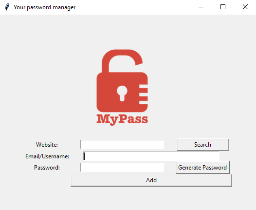
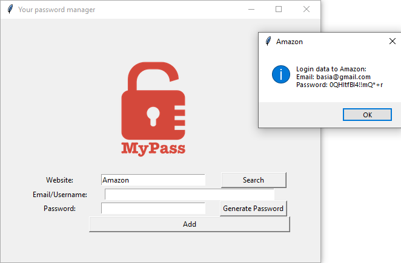

# The password manager
> The password manager allows to:
- keep passwords to sites in the file,
- create a new password,
- search for saved passwords 

## Table of Contents
* [Technologies Used](#technologies-used)
* [Features](#features)
* [Project Status](#project-status)

## Technologies Used
- Python 3.12

## Features
List the ready features here:
- Creating password with random letters, numbers and symbols,
- Showing data to log in to the wanted site

## Project Status
Project is: _complete_

